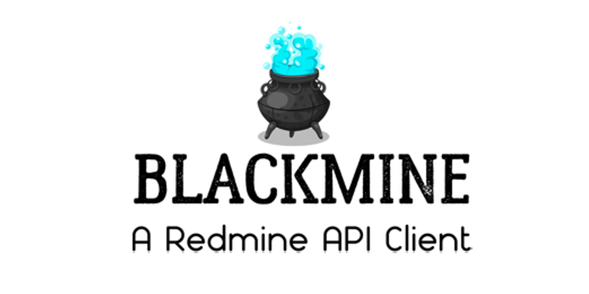

# :jack_o_lantern: Blackmine

Blackmine is a full featured Redmine API client written in PHP 8. Heavily based on interfaces, abstract classes and all kind of dirty tricks like magic methods and traits to allow quick reaction to the frenzy Redmine API updates activity. :D

## Quick example

Of corpse you need to require the package using composer:


<pre><font color="#8BE9FD">composer</font><font color="#F8F8F2"> </font><font color="#BD93F9">require</font><font color="#F8F8F2"> </font><font color="#BD93F9">blackmine/blackmine</font></pre>

and then, the magic:

```php

$options = new \Blackmine\Client\ClientOptions([
    ClientOptions::CLIENT_OPTION_BASE_URL => "https://your.redmine.url",
    ClientOptions::CLIENT_OPTION_API_KEY => "your.api.key"
]);

$client = new \Blackmine\Client\Client($options);
$issues = $client->getRepository("issues");

$data = $issues
    ->addFilter(Issues::ISSUE_FILTER_ISSUE_ID, [41432, 41436])
    ->with([Issues::ISSUE_RELATION_WATCHERS])
    ->search();

$issue = new \Blackmine\Model\Issue\Issue();
$issue->setSubject("Test Issue");
$issue->setDescription("An issue description, yeah, a real one...");
$issue->setStartDate(\Carbon\CarbonImmutable::create(2021, 10, 31));
$issue->setDueDate(\Carbon\CarbonImmutable::create(2022, 10, 31));
$issues->create($issue);

```

## Status

Actually only JSON format is supported, yeah, JSON is cool and XML isn't. If you think  XML is cool enough you can fork the project, start the feature/xml_is_cool branch and pull request your coolness.

We are focusing development by now, on apis marked as stable/beta by Redmine team, once those apis will be finished and tested maybe we can start to look alpha ones with the corner of the eye.

Blackmine uses [Requests](https://requests.ryanmccue.info/) as transport layer, in a near or not so near future, I will try to pivot to a PSR18 implementation. If you can't wait, you can fork the project, start the feature/psr18_or_death and pull request your hurry ups.

As we are in a so, really so, so, so, alpha stage, of course there are no documentation at all or comments in the code, because comments in the code are no more than a mask for a bad code. Check the code and try to understand, is not black magic.

## Things that are almost complete:
 - [Issues API](https://www.redmine.org/projects/redmine/wiki/Rest_Issues)
 - [Projects API](https://www.redmine.org/projects/redmine/wiki/Rest_Projects)
 - [Users API](https://www.redmine.org/projects/redmine/wiki/Rest_Users)
 - [Time Entries API](https://www.redmine.org/projects/redmine/wiki/Rest_TimeEntries)
 - [Issue Categories API](https://www.redmine.org/projects/redmine/wiki/Rest_IssueCategories)
 - [Issue Statuses API](https://www.redmine.org/projects/redmine/wiki/Rest_IssueStatuses)
 - [Issue Relations API](https://www.redmine.org/projects/redmine/wiki/Rest_IssueRelations)
 - [Trackers API](https://www.redmine.org/projects/redmine/wiki/Rest_Trackers)
 - [Groups API](https://www.redmine.org/projects/redmine/wiki/Rest_Groups)
 - [Versions API](https://www.redmine.org/projects/redmine/wiki/Rest_Versions)
 - [Roles API](https://www.redmine.org/projects/redmine/wiki/Rest_Roles)
 - [Custom Fields API](https://www.redmine.org/projects/redmine/wiki/Rest_CustomFields)
 - [Memberships API](https://www.redmine.org/projects/redmine/wiki/Rest_Memberships)
 - [Files API](https://www.redmine.org/projects/redmine/wiki/Rest_Files)
 - [Enumerations API](https://www.redmine.org/projects/redmine/wiki/Rest_Enumerations)
 - [Attachments API](https://www.redmine.org/projects/redmine/wiki/Rest_Attachments)
 - [Wiki Pages API](https://www.redmine.org/projects/redmine/wiki/Rest_WikiPages) (bugged)
 - Caching responses (with Tag/TTL invalidation mechanism)
 - Impersonating users (for admin users)

## Things that are incomplete:
 - Documentation
 - Search fluent API (80%)
 - Error handling and exceptions (0%)
 - Model functionality (50%)
 - Unit tests (0%)
 - Magic methods signatures on models and repositories (50%)
 - Date conversion from and to CarbonImmutable objects